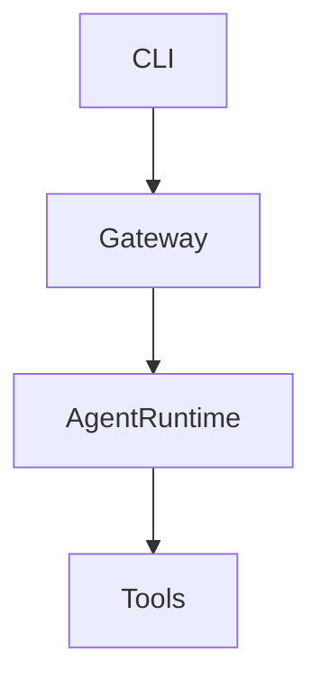
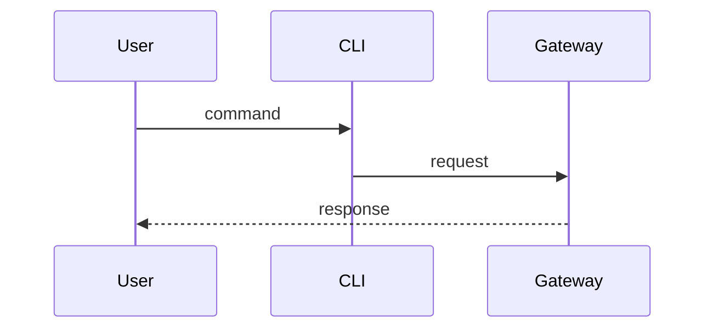

# openclaw/openclaw

## 1. 项目用途

Personal AI assistant runtime for local and gateway agents.

## 2. 安装方法

```bash
npm install -g openclaw@latest
openclaw onboard
```

Requires Node 22+ per README.

## 3. 软件架构

Monorepo with gateway, CLI, and agent workspaces.



## 4. 运行逻辑

User invokes CLI; gateway routes to agent session.



## 5. 风险

- Early-stage API surface may change.
- Requires correct API keys in environment.
